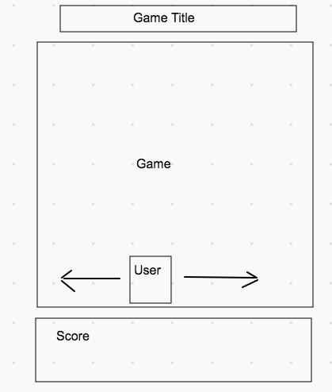
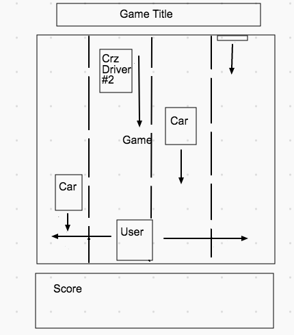

# Wangan Midnight<br/>
# 湾岸竞速

## Repository
https://lev-choubine.github.io.git/

## Concept
A vintage styled collision game with Manga and Nostalgia elements. The user drives a car into oncoming traffic and must avoid collision with black cars on the highway. The user wins once a set amount of points is accumulated. A ‘grey oncoming car’ is randomly generated on the screen. The user accumulates points while passing the ‘grey car’ and gets double points if the ‘grey car’ is bumped of the road. The program generates pop-up elements with manga images, blinking Katakana messages followed by vintage game sound effects and racer quotes to respond to game events such as collisions, point accumulation, winning, while listening to some high quality City Pop!!!! <br /> [what is City Pop?](https://en.wikipedia.org/wiki/City_pop)


## File Structure


### javaScript breakdown
We are distributing our code between 4 files for readability and ease of access. 
<br />We start with data.js which will host constants with links to images, sounds, quotes and other data we will use in our application. The developer can use this file to upload new design content without having to read through the rest of the code.
<br />
status.js will host variables that hold values used by the functions to build out game logic. We have accumulators, variables that will dictate what certain steps are, variables that will reflect status of an event or a functioin.
<br/> helper.js hosts functions that we used to run elements of our game.
<br/> app.js hosts event listeners and our 'rePaint' function that will render all the car moves.


### Media
3 PNG images car images with transparent back ground
pngkey.com-white-car-icon-png-7789675.png - USER CAR
NicePng_car-top-view-png_9645777.png - COMPUTER BOTS TO AVOID
kisspng-car-clip-art-bed-top-view-5ace3e1db48997.1233454315234657577395.png - COMPUTER BOT THA HELPS GENERATE POINTS
Do not rename the PNG files as it might resave them without transparent background property.

3 MP3 FILES
carcrash.mp3 - sound effect for collision - must be 1 sec or shorter to fit the timing of the game.
backgroundMusic.mp3 - the track that will loop while the user plays the game
pointsSound.mp3 - sound effect for point accumulation

5 JPEG files
Road1, Road2, Road3, Road4, Road5 - background images for the canvas

old_tv_empty_screen.png - using it as our app background

tell.jpeg - using it as background for inspirational quotes

game-page-layout.png and Game-elements.png are used by this README.


### HTML

The canvas element is hosted within a 'container' div to enable more design manipulations. We are also storing a 'Katakana' div with a child paragraph element that will display blinking Katakana messages while the DIV itself will provide the background. 
```HTML
 <div class="container">
    <canvas id="game" height=300 width=300>Hello!</canvas>
     <div id="katakana">
             <p class="blinking" id="blob"> ガンバレ</p>
    </div>
 </div>
```

The div element below will host Racer quotes and manga images to encourage our users to do their best. We will change the visibility of this element via javaScript and CSS later.

```HTML
 <div  id="message">
        <h3 id='racequote'>
            'Speed has never killed anyone, suddenly becoming stationary… that’s what gets you.'
         </h3>
</div>

```
This element will display user points. Using  nested div elements. The 'points' element is to position it on the screen while 'pointowa' (means 'the points are' in Japanese) contains background.

```HTML
 <div id = "points">
     <div id="pointowa">
         <h3>Points</h3>
            <h3 id="point-tracker">000</h3>
        </div>
    </div>
```
Cheers element will display short game messages - such as 'You Win'.
```HTML
  <div id="cheers">
     <h3 id="speil">Click on the TV to begin or hit 'S'</h3>
  </div>
 ``` 
The two elements below contain game instructions. One will go above the game screen while the other will go below.
 ```HTML
    <div class="slide" id="instructions">
        <h3>Driving on agains traffic is not one who is week hearted. Avoid collision the oncoming cars. Evrytime you pass a grey car you will generate 150 points. You can push the grey car off the road to doulbe your points. The game is won when you reach the total of 3000 points! 
        </h3>
    </div>

    <div class="slide" id="instructions2">
         <h3>
        Press 'A ' to move your card to the left <br />
        Press 'D' to move your card to the right <br />
        Press 'P ' to pause the game <br /> 
        Press 'R' to resume
        </h3>
    </div>
 ```
The "terebi" or ('TV set' in Japanese) element contains the vintage TV set image. The image will change to a car crash if the user collides with another car.
 ```HTML
  <div id="terebi">
 ```
We are working with 4 javaScript files here and it is important that the following ordered is maintained for all elements to work together. data.js information is used with status.js, then in helper.js by the functions then all is tied to events in app.js.
 ```HTML
        <script src="data.js"></script> 
        <script src="status.js"></script>
        <script src="helper.js"></script>       
        <script src="app.js"></script> 
 ```
### CSS 
We will be manipulation position on graphic elemenst with "margin" property to make sure the elements lend where we want them to on the page.

The game can be resised to run on smaller screens.

``` CSS
@media only screen and (min-width: 950px) and (max-width:  1250px){

}
@media only screen and (min-width: 600px) and (max-width:  950px){

}
```
The width of out main element is locked to a value to keep our design model together.

```CSS
main {
    max-width: 1260px;
    margin: auto;
  
}
```
Blinking animation for Katakana messages!
```CSS
  .blinking{
    animation:blinkingText 0.5s infinite;  
}

@keyframes blinkingText{
    0%{     color: rgb(255, 255, 255);    }
    49%{    color: rgb(197, 189, 189); }
    60%{    color: transparent; }
    99%{    color:transparent;  }
    100%{   color: rgb(255, 255, 255);    }
}
```
We will be importing images via CSS 3 times

```CSS
#terebi {
 
    height: auto;
    background-image: url('old_tv_empty_screen.png');
    background-repeat: no-repeat;
    background-size: 90%;
    background-position: center;
    
}

#message {
  visibility: hidden;
  margin-top: -31%;
  z-index: 1;
  width: 30%;
  background-image: url('tell.jpeg');
  background-repeat: no-repeat;
  background-size: cover;
  text-align: center;
  transition: 2s;
  
}

#cheers{
  background-image: url('https://cdn2.vectorstock.com/i/1000x1000/00/01/manga-comics-radial-speed-lines-vector-1520001.jpg');
  background-repeat: no-repeat;
  background-size: cover;
  width: 20%;
  height: 600%;
  font-size: 40px;
  margin-left: 70%;
  margin-top: -15%;
  visibility: hidden;
}

```
Slide in animation for instructions when you open the game.

```CSS
.slide {
  /* for chrome and safari*/
  -webkit-animation-duration: 1s;
  -webkit-animation-name: slidein;

  /*for firefox*/
  -moz-animation-duration: 1s;
  -moz-animation-name: slidein;

    /* for opera*/
  -o-animation-duration: 1s;
  -o-animation-name: slidein;

    /* Standard syntax*/
  animation-duration: 1s;
  animation-name: slidein;
}

@-webkit-keyframes slidein {
  from {
      margin-left: 100%;
      width: 100%;
  }

  to {
      margin-left: 0%;
      width: 100%;
  }
}

@-moz-keyframes slidein {
  from {
      margin-left: 100%;
      width: 100%;
  }

  to {
      margin-left: 0%;
      width: 100%;
  }
}
@-o-keyframes slidein {
  from {
      margin-left: 100%;
      width: 100%;
  }

  to {
      margin-left: 0%;
      width: 100%;
  }
}
@keyframes slidein {
  from {
      margin-left: 100%;
      width: 100%;
  }

  to {
      margin-left: 0%;
      width: 100%;
}
}
```

## Game logic
### Game infrastructure

The game will render in HTML CANVAS. 



### Winnig and Loosing

The game is lost when the user’s car collides with the 'black cars' generated by the program. The game is won if user generates a set amount of points without ay collisions.

### Game elements
* The canvas will be divided into 4 lanes where the cars will be moving. The user's car will be positioned at the bottom of the screen and will move either left or right. The oncoming cars and another crazy driver will be randomly generated by the computer in each lane. The cars will move from the top of the field to it's bottom eventually leaving the field if no collision occurs. Crazy driver #2 will move from the top of the field to it's bottom at much slower pace and will eventually exit the screen.


-  State Driven Game based on events responses inside the HTML CANVAS while set to interval rendering


## Status Variables
counters<br/>
these variables will help us cycle through different elements of the game
```JS
//COUNTERS///
let counter = 0;//for road animation
let carOneCounter = 0;// sets counter to move oncoming car 1
let carTwoCounter =0;//
let carThreeCounter = 0;
let pointAccumulator = 0;//accumulates game points
```

defaults<br/>
these variables will be used to restore values at the end of the function’s cycle
```JS
//DEFAULTS
const laneDefault = 38;// coorinates of our first lane
const laneGap = 75;//space between our lanes
const pointAccumulatorDefault = 0;
const setPointAmount = 3000;// the amount of points we want to reach to win the game
const oneWin = 150; // points accumulated at one time
const step = 20;// sets step for user movement
const carRange = 380;// set visible range for cars 
const fieldHeight = 300;// height of our canvas
const fieldWidth = 300//width of our canvas
```
car movement<br/>
```JS
//CAR MOVEMENT
let carOne;// will host value of class objects generated by the game
let carTwo;
let carThree;
let carStep = 4;// default car speed in pixels
const carStepDefault = 3;
let carImage = otherCarImages;// resets BOT cars back to black
```

status
```JS
///STATUS VARIABLES/
let gameStatus = 'gameOver'//defines if the games is runni
let gameWon = false;
let crazyStatus = false; //randomly turns black car 1 into a grey car
let crazyStatus2 = false;//used for other cars to keep them in the same state
let carHit = true;//tracks collisions
let sugoi = false;//tracks when a grey car is bumped off the road to trigger point accumulation and pop up art
let car2enter = false; // used to wait for car2 to enter the sreen at the sart of the ga,e
let car3enter = false;
let paused = false; // used to pause the game
let playMuisc = 0;// used to paly music only once 
```

class objects <br/>
We are declaring all of our class objects here. 

The car class contains a `draw` function inside it's render method.
```js
class Car {
    constructor(centerX, centerY, status, image) {
        this.x = centerX-20;
        this.y = centerY -15;
        this.width = 40;
        this.height = 40;
        this.crazyDriver = status;
        this.image = image;
        this.live = carHit;
     }render(){
        const x = this.x;
        const y = this.y;
        const w = this.width;
        const h = this.height;
        const img = new Image();
        img.onload = draw;
        img.src = this.image;
        function draw() {
        const ctx = document.querySelector('canvas').getContext('2d');
        ctx.drawImage(img, x, y, w, h);
        }
        draw();
     }
}; 
```
We added a 'repeat' property to our sound object. If passed as 'yes' the audio will loop through out the game - using this for background music, if 'no' is passed the sound will only play once - used for sound effects.s
```js
function sound(src, repeat) {
    this.sound = document.createElement("audio");
    this.sound.src = src;
    this.sound.setAttribute("preload", "auto");
    this.sound.setAttribute("controls", "none");
    this.sound.style.display = "none";
    document.body.appendChild(this.sound);
    this.play = function(){
      this.sound.play();
      this.sound.addEventListener('ended', function() {
          if(repeat === 'yes'){
            this.currentTime = 0;
            this.play();
          }
        
    }, false);
    }
    
  }
```
## Helper Functions

Background animation
``` js
// Declaring a function to render images onto hte HTML CANVAS
     function drawBgImg(img) {
        let bgImg = new Image();
         bgImg.src = img;
         ctx.drawImage(bgImg, 0, 0);  
     }   
     
    
 // Switching images in the background. Pulling them from a an array to enable animation one by one.
     function background(){
         if(counter===0){
            drawBgImg(roadImages[0]) 
              counter = 1;
             }else if(counter === 1){
                drawBgImg(roadImages[1])
                 counter = 2;
             }else if(counter === 2){
                drawBgImg(roadImages[2])
                 counter = 3;
             }else if(counter === 3){
                drawBgImg(roadImages[3])
                 counter = 4;
             }else{
                drawBgImg(roadImages[4])
              counter = 0;
         }
     }
```
Picking car lanes <br />

Each choice of coordinates is randomized and saved to variable that will be later used the program to render car animation.

```js
function pickAlane () {
    let index = Math.floor(Math.random() * 4);
    lane = laneChoices[index];
    crazyDriver2()
}

function pickAlane2 () {
    let index = Math.floor(Math.random() * 4);
    lane2 = laneDefault + (laneGap * index);    
}

function pickAlane3 () {
let index = Math.floor(Math.random() * 4);
lane3 = laneDefault + (laneGap * index);    
}

```
Rendering pop-up elements <br/>
These function will alter text, visibility and background images on the pop ups in response to game events.

for example our 'sugoii' (which means 'cool') in Japanese will display blinking signs for 5 seconds after a grey car is bumped off the road
```js
//////--------------------------RENDERING POP-UP ELEMENTS/-------------------/////////////
//--------START GAME ----------//
function sugoii(){
   
    document.getElementById('blob').innerText='スゴイ！！';
    document.getElementById('blob').style.visibility="visible";
    document.getElementById('cheers').style.visibility="visible";
    document.getElementById('speil').innerText = "Double Points!"
    setTimeout(function (){document.getElementById('blob').visibility="hidden";document.getElementById('cheers').visibility="hidden"
    
     }, 5000)
}
```
Car movement functions<br/>
Moves our cars through canvas. Our carOne will also host a decent amount of logic that we will use to win the game
```js
function carMove(){
    carOne = new Car(lane,(carOneCounter), crazyStatus, carImage);//creates a carOne object
         carOne.render() //draws the car
         carOneCounter = carOneCounter + carStep //moves the car in canvas
         if (carOne.crazyDriver === true && carOne.y ===(userCar.y+userCar.height)){//checks for a grey car
             pointAccumulator = pointAccumulator + oneWin;//accumulates points if you hit the grey car
             document.getElementById('point-tracker').innerHTML=pointAccumulator;//cnahges point value on your screen
             if(pointAccumulator >= setPointAmount){// wins the game once you accumulate  enough points
                     gameWon = true;
                     pointSounds.play()
             document.addEventListener('keydown', function(e){
                 if(e.key==='s'){//enables you to start the game again
                     console.log(gameStatus);
                     gameWon = false;
                     startGame();
                 }})
             }
         } 
         return carOneCounter;
    };
```

Status functions <br/>
These functions will either check for condition - such 'as' collission or win. These will also be used to reset the game when we press "S". The fuction below will allow us to bump a grey car off the raod if the "crazyDriver2" property is 'true".

```js
//-------BUMPING A CAR OFF THE ROAD GENERATING DOUBLE POINTS--------//
function doublePoints(){
    if(userCar.x <= carOne.x + carOne.width
        &&userCar.x + userCar.width > carOne.x + carOne.width  
        &&  userCar.y < carOne.y + carOne.height
        && userCar.y + userCar.height > carOne.y
        && carHit ===true ){
           rightBump()
             
        }else if(userCar.x + userCar.width >= carOne.x
           && userCar.x < carOne.x 
           &&  userCar.y < carOne.y + carOne.height
           && userCar.y + userCar.height > carOne.y
           && carHit ===true){
           leftBump()        
        }
```

app.js <br/>
Will host our repaint function that we will set interval for to enable animation. We will also enable user controls here <br/>

```js
function rePaint(){

        if(gameStatus === "running"){
            gameRunnig()
        }else{
            gameNotRunning()
        }
         ctx.clearRect(0, 0, fieldWidth, fieldHeight)//wipes out previously drawn images
         drawBgImg(roadImages[0])
     if(gameStatus==="running"&&gameWon === false&&　paused===false){//runs the function if the user is still playing
        background()// renders background in canvas
        userCar.render() //displayes user's car
        car2();//moves our cars
        car3();
        carRangeCheck();//checks if the cars have travelled through canvas to reset their properties and launch them again
        }else{
        staticRender();
         document.addEventListener('keydown', function(e){// renders static elements if the game is not running
             if(e.key==='s'){
                 startGame();
             }
         })
     }
     detectCrash();//checks for crashes and collision
     detectCrash2(); 
     detectCrash3(); 
     detectCrashCrazyDrvier(); //randomly turns a black car into a grey car and enables point accumulation
    }//closes rePaint function!!
   
    setInterval(rePaint, 1000/60);//runs the game animation at 16.6 ml seconds
```


